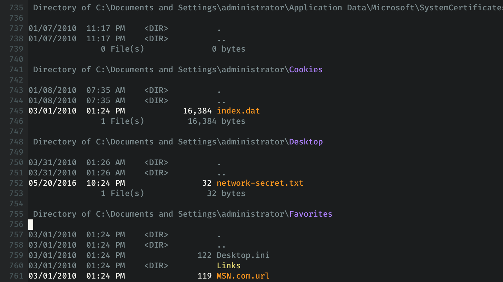

# Vim Windir Syntax

_Better skimming for Windows directory listings._




Vim colorization for for Windows directory listing, from Windows commands such as:

```
dir /s /a C:\ > c.windir
```

## Installation

Copy `windir.vim` into `~/.vim/syntax/` and optionally add the following to `~/.vimrc`:

```
au BufNewFile,BufReadPost *.windir  set filetype=windir
```
